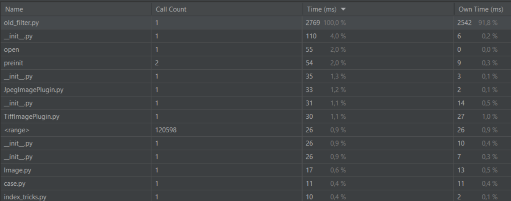
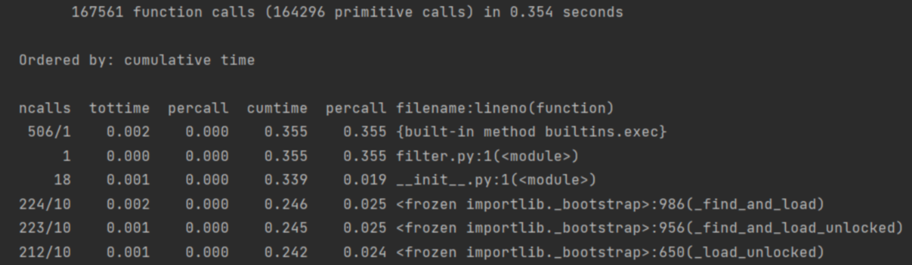
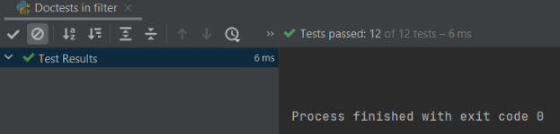

#5 и 6 номера

Запуск old_filter.py c профилизатором.

Запуск filter.py c профилизатором.

Быстрее выполняется код после рефакторинга, т.к методы numpy работают в целом быстрее циклов.

#7 и 8 номера
Так как я не трачу время на ввод данных с консоли , а использую аргументы командной строки, то данные профилизатора будут такие же, как и на втором скриншоте

#9, 10 и 11 номера

Результат запуска тестов.